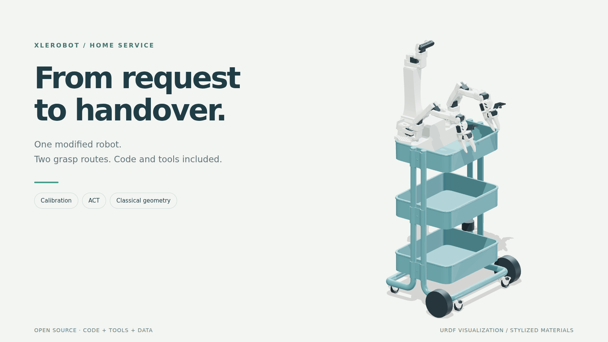
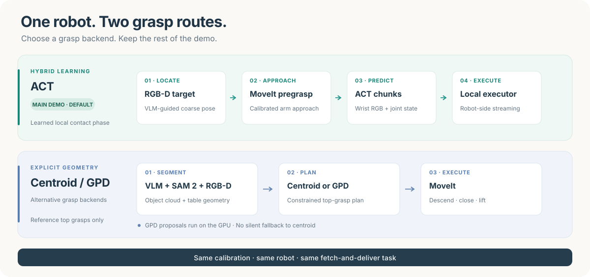
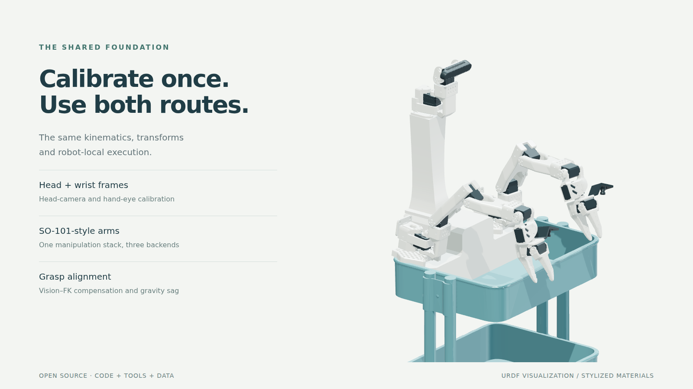
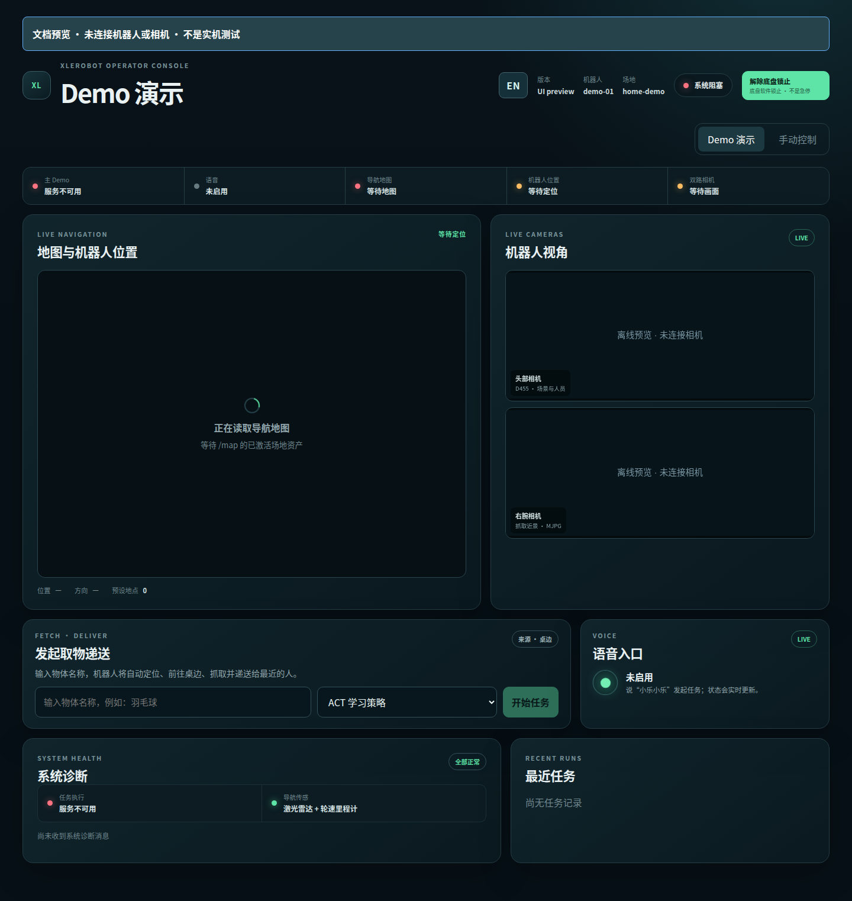
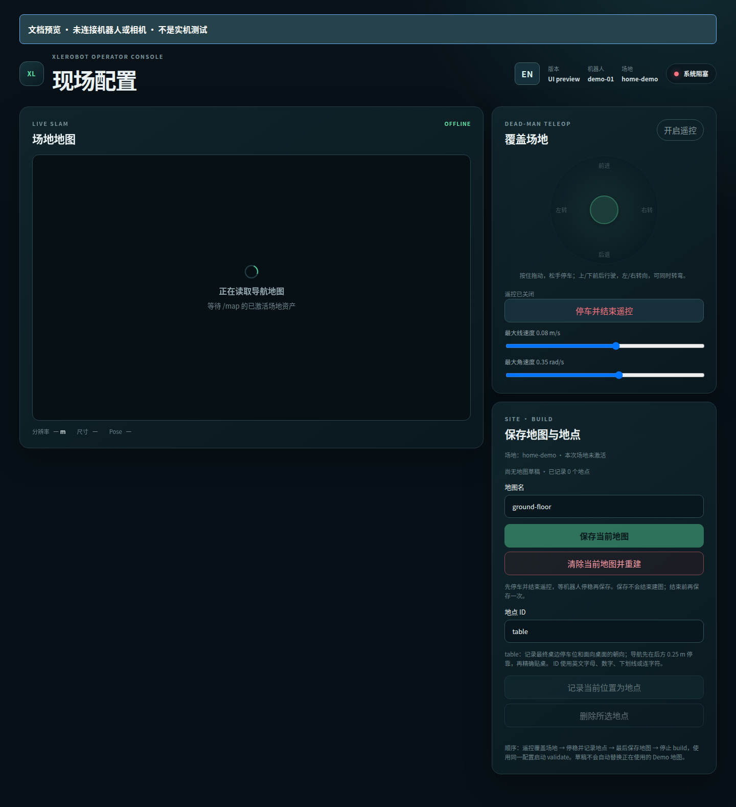
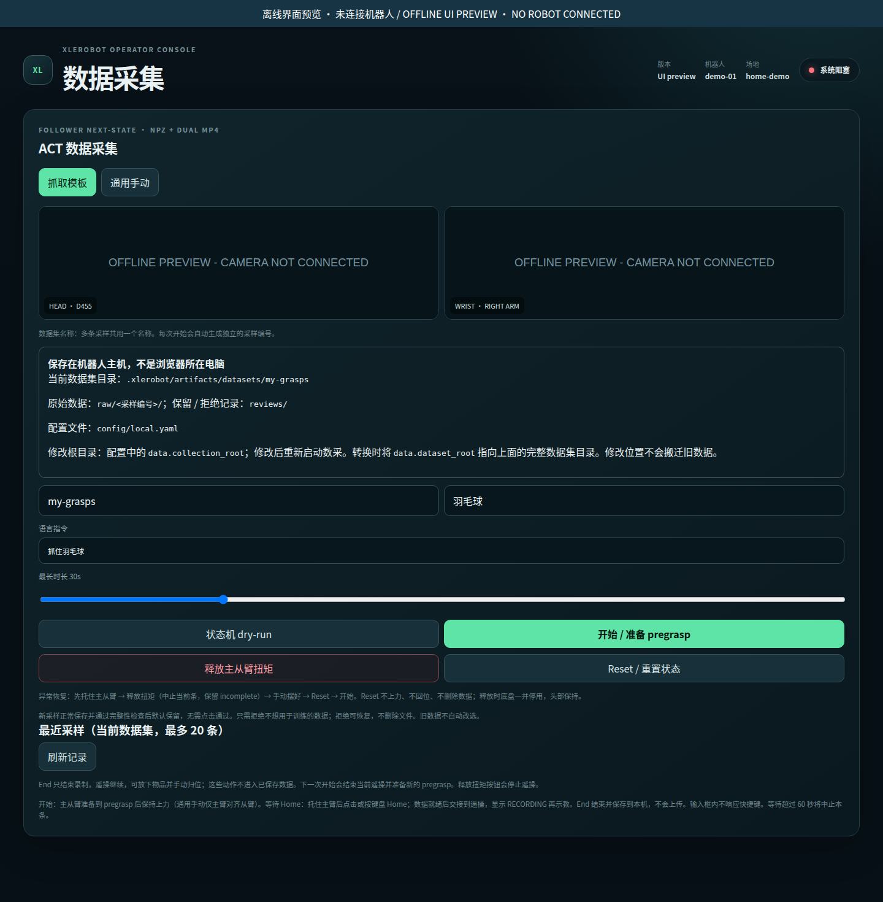

<h1 align="center">XLeRobot Home Service Demo</h1>

<p align="center">
  A slightly modified XLeRobot. A spoken request. An object delivered.<br/>
  <strong>The demo, calibration tools and grasping backends to reproduce it.</strong>
</p>

<p align="center">
  <a href="README.zh-CN.md">中文</a> ·
  <a href="docs/en/README.md">Documentation</a> ·
  <a href="https://huggingface.co/lissajous/xlerobot-act-local-grasp-v1">ACT weights</a> ·
  <a href="https://huggingface.co/datasets/lissajous/xlerobot-glue-stick-grasp-30">30-demo dataset</a>
</p>

<p align="center">
  <a href="https://www.bilibili.com/video/BV1srNg6XEZj"><strong>▶ Full robot demo</strong></a> &nbsp;·&nbsp;
  <a href="https://www.bilibili.com/video/BV18RK66JEdP">ACT grasping</a> &nbsp;·&nbsp;
  <a href="https://www.bilibili.com/video/BV1GSK66XEqf">Web console</a>
</p>

<p align="center">
  
  <br/><sub>URDF visualization, not a photograph. <a href="docs/artwork/README.md">Source &amp; rendering</a> · Real robot in the videos above.</sub>
</p>

## One robot, two grasp routes

The same calibrated robot stack handles the full task: find the table, grasp an
object, find a person and deliver it. Change the grasp backend, not the demo.



- **Hybrid ACT — the main demo.** RGB-D target → MoveIt pregrasp → wrist-image
  ACT action chunks → robot-local execution.
- **Classical geometry — two alternative backends.** VLM + SAM 2 + RGB-D →
  `centroid` or `gpd` top-grasp plan → MoveIt execution. GPD runs on the GPU
  computer; failure never silently switches to centroid. This is top-grasp,
  not general 6-DoF grasping.

The default is **ACT + shuttlecock (`羽毛球`)**, with voice and web enabled.
The published checkpoint was trained on **30 yellow-glue-stick demonstrations
only**. Shuttlecock grasping is a qualitative generalization demo, not a
measured success-rate or general-purpose grasping claim.

## Reproduce the demo

### 1 · Match the reference build

| Part | Reference configuration |
| --- | --- |
| Robot | Modified two-wheel XLeRobot, two SO-101-style arms, pan/tilt head |
| Sensors & audio | D455, right-wrist USB camera, LD06-style lidar, microphone and speaker |
| Robot computer | Ubuntu 24.04 x86_64 · ROS 2 Jazzy |
| GPU computer | NVIDIA Ubuntu/WSL2; verified on Ubuntu 24.04 WSL2 + RTX 3080 |
| VLM | LM Studio serving `qwen/qwen3-vl-4b` |

[BOM, wiring and mounting →](docs/en/hardware.md) A right Leader arm is needed
only to collect your own data. This configuration targets the reference build,
not every upstream XLeRobot variant.

### 2 · Install on Robot and GPU

Clone on both computers, then fill in the local configuration:

```bash
git clone --recurse-submodules https://github.com/xujiayuxian-png/xlerobot_home_service_demo.git
cd xlerobot_home_service_demo
cp config/local.example.yaml config/local.yaml
cp .env.example .env
```

Device names, LAN URLs and file paths go in `config/local.yaml`; the same ACT
token goes in both `.env` files. [Prerequisites and configuration checklist →](docs/en/install.md)

```bash
# GPU computer
./tools/setup gpu
./tools/act download
# For native GPD, use ./tools/setup gpu --with-gpd instead.

# Robot computer — full voice + person-finding demo
./tools/setup robot --with-person-detector --with-kws-model --generate-voice-prompts
```

Use the published checkpoint directly; **no collection or training is required**.
Other inference assets are listed in [models and data](docs/en/assets.md).

<details>
<summary>Optional model licenses</summary>

The person detector is an explicit AGPL-3.0 extra. KWS model terms remain
unresolved; setup downloads it directly from its provider, and it is not
redistributed here. See the [installation guide](docs/en/install.md) and
[third-party notices](THIRD_PARTY_NOTICES.md) before enabling these extras.

</details>

### 3 · Check dependencies

```bash
./tools/doctor gpu     # on GPU
./tools/doctor robot   # on Robot
```

Doctor is read-only: it opens neither cameras nor motors. Missing calibration,
map or running services are expected on the first pass; finish the steps below
and check again before running the demo.

### 4 · Calibrate and map your site

<p align="center">
  
  <br/><sub>URDF visualization · <a href="docs/artwork/README.md">Source &amp; rendering</a></sub>
</p>

```text
servo → head-camera → right-handeye ─┐
base (independent measurements) ────┴→ grasp-alignment → activate → render
```

[Calibration, printable targets and replay →](docs/en/calibration.md)

Then [build a map, save the `table` place and activate the site](docs/en/mapping.md).
Your build needs its own calibration and map; neither is bundled in the repository.

### 5 · Try the grasp backends

```bash
# GPU: start LM Studio first, then
./tools/run gpu

# Robot, terminal 1: start the shared demo stack
./tools/run demo --hardware

# Robot, terminal 2: submit ONE task per trial
./tools/run grasp act --hardware
./tools/run grasp centroid --hardware
./tools/run grasp gpd --hardware
```

`grasp` submits a **complete fetch-and-deliver task**, not an arm-only motion.
The target comes from `demo.object_id`. [Backend behavior →](docs/en/grasping.md)

### 6 · Use voice or the web console

The running demo waits for a request; it does not submit one automatically.
Open **`http://<robot-host>:8080`**, or say **“小乐小乐”** and request an object.
Voice uses the configured default backend; the web console lets you select it.

```text
localize → navigate/dock → perceive → grasp and verify
→ find person → approach → speak → hand over
```

[Full demo walkthrough →](docs/en/demo.md)

## Tools you can use on their own

<table>
  <tr>
    <th>Demo console</th>
    <th>Mapping &amp; places</th>
    <th>ACT collection</th>
  </tr>
  <tr>
    <td width="33%"><a href="docs/en/demo.md"></a></td>
    <td width="33%"><a href="docs/en/mapping.md"></a></td>
    <td width="33%"><a href="docs/en/act-workflow.md"></a></td>
  </tr>
</table>

<p align="center"><sub>Actual frontend, offline layout previews; empty sensors are intentional. The current UI uses Chinese labels.</sub></p>

Five entry points cover the project:

| Entry point | Purpose |
| --- | --- |
| `tools/setup robot\|gpu` | Install from source |
| `tools/doctor robot\|gpu` | Check dependencies and services |
| `tools/calibrate` | Capture, solve, activate, replay and roll back calibration |
| `tools/act` | Collect, convert, train, evaluate and download |
| `tools/run` | GPU services, mapping, backend-selected tasks or the demo |

For your own demonstrations, follow [collect → convert → train](docs/en/act-workflow.md).
Recording is **Start → Home → End → next episode**: valid recordings are kept
by default, and End leaves teleoperation active so you can put the object down.

## Scope, status and licenses

Demo, mapping and collection have been exercised on the reference robot with
its existing calibration. **The new live calibration workflow and resulting
physical accuracy still await on-robot acceptance.** Solver replay is not a
physical accuracy test.

Real motion requires `--hardware`. Local settings, maps, calibration, recordings,
weights and logs stay out of Git; runtime assets normally live in `.xlerobot/`.

Project code, documentation and ACT weights: [Apache-2.0](LICENSE).
The 30-demo dataset: [CC BY 4.0](https://huggingface.co/datasets/lissajous/xlerobot-glue-stick-grasp-30).
[Third-party assets retain their own terms.](THIRD_PARTY_NOTICES.md)

<h2 align="center">Follow the author</h2>

<p align="center">
  <strong>徐头头 · Xiaohongshu</strong><br/>
  <a href="docs/images/xiaohongshu.jpg"></a><br/>
  <sub>Scan in Xiaohongshu, or search <strong>LISSAGOGOGO</strong>. Click the card for full resolution.</sub>
</p>

---

[Documentation](docs/en/README.md) · [Troubleshooting](docs/en/troubleshooting.md)
· [Models and data](docs/en/assets.md) · [Source layout](docs/en/README.md#source-layout)
