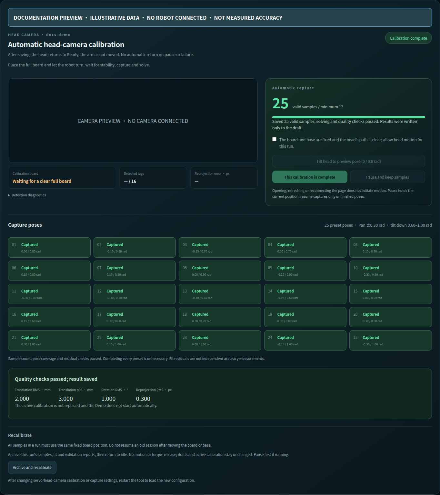
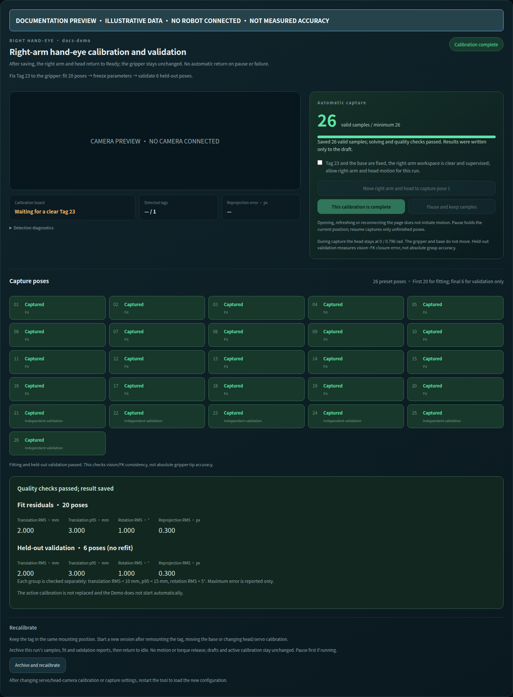
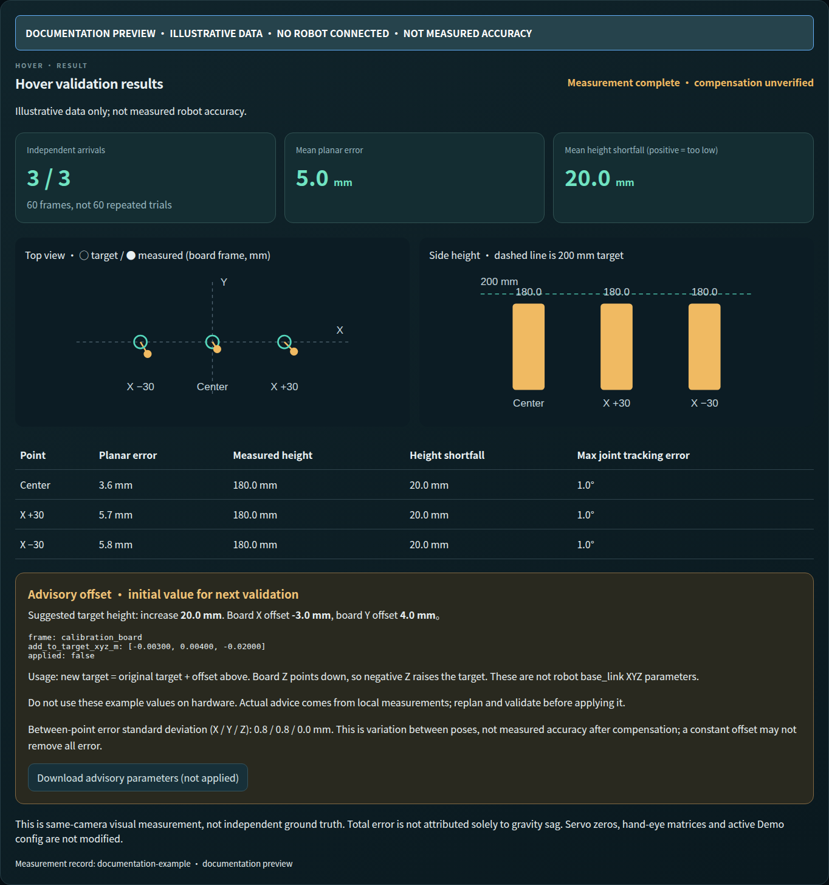

# One robot calibration workspace

[Calibration overview](calibration.md) · [中文](../zh-CN/calibration-workbench.md)

This workspace supports the **right-arm demo**: head-camera calibration,
right-arm hand-eye and right-arm hover validation. Left-arm servo capture is an
additional tool, not acceptance of a left-arm or dual-arm demo. The Leader is
the independent right-arm demonstration input.

## Page previews

These are the built frontend with **illustrative data**, not measured accuracy.
No robot or camera was connected. [Capture source and provenance](../images/README.md).

| Head-camera calibration | Right-arm hand-eye: fitting and held-out validation |
| --- | --- |
|  |  |

The hover page compares target and observed positions and proposes an unapplied
offset. The values below are examples, not parameters to copy to your robot.



## Start

Finish the Robot source installation and HMI build, and prepare `config/local.yaml`.
Stop other Demo, mapping, collection or standalone calibration sessions first:

```bash
./tools/calibrate web --hardware
# Open http://<robot-host>:8080/
```

To inspect and manage saved results without connecting devices:

```bash
./tools/calibrate web
```

Use `--config PATH` or `--web-port 8083` to select another configuration or port.
Starting the web workspace does not open devices. The explicit session button
launches the existing ROS capture tool. Automatic motion requires a separate
confirmation in that tool. Use this page on a trusted LAN, not the public internet.

Use the **EN / 中文** button in the top-right corner to switch workspace labels
and status guidance. The preference is stored in the browser. Calibration paths,
version IDs, measurements and device names remain unchanged.
The switch also covers confirmation dialogs, chart labels and local documentation
links. It does not remount controls, restart streams, or initiate device commands.
Known service messages are translated; unexpected diagnostics and session logs
retain the original text for troubleshooting (labeled “Original service detail”
when needed).

For contributors: UI copy is rendered explicitly with `useLanguage().t()` and
the exact-message catalog in `web/src/translations.ts` under `xlerobot_hmi`.
Store asynchronous UI notices with `msg(source, ...values)`; pass user data as
arguments, never translate it. `serviceTranslations.ts` handles known complete
service messages, without altering ROS protocols. Run `npm test` and
`npm run build` in `ros2_ws/src/xlerobot_hmi/web` after changing UI copy. Tests
check translation coverage, English pages, round-trip switching, unchanged
collection payloads, and uninterrupted teleoperation connections.

## Workflow

| Page | Operation | Output |
| --- | --- | --- |
| Follower and head | Existing zero / travel capture wizard | Structural servo draft |
| Leader | Independent six-joint wizard; optional | Separate collection calibration |
| Head camera | Full tabletop 4×4 board, then start automatic capture | Solved camera draft |
| Hand-eye | Rigidly mounted Tag 23; prepare and start | 20 fitting + 6 held-out poses |
| Hover accuracy | Automatically validate three points, board and Tag 23 visible together | Comparison charts, per-point errors and advisory offsets |
| Results | End device session; preview, apply or restore | Immutable version and runtime YAML |

After each calibration, confirm completion to save its draft and predecessor
association. Successful head calibration returns the head to ready; successful
hand-eye calibration returns the right arm, then the head, using the shared
`startup_ready.yaml` targets. The gripper stays unchanged. Completion is reported
only after returning; a return failure preserves the saved draft and is resumable.
Failed or paused calibration does not automatically return. Confirming completion
records the predecessor association without activating the Demo configuration. Hover reports save
automatically. Browsing another tab leaves the current controls mounted and does
not cancel an operation or restart it during status refreshes.

To change devices, explicitly end the current session first. **Closing the driver
may remove holding torque: support or rest the arm before confirming.** The
workspace waits for its own launch process group to exit. It rejects devices
already owned by another tool rather than killing or attaching to that tool.

## Reuse and repeat

Follower/head and Leader pages offer a restart button even after finalization.
It archives the entire round and reopens the same device session. The per-group
reset remains available before finalization. Visual sessions check predecessor
and pose-set compatibility before opening devices, offering an explicit archived
fresh start when resume is incompatible. An out-of-range starting joint is shown
in the session banner; support and reposition it before controller loading continues.

- Passing drafts can be reused without repeating upstream calibration.
- If only an active version exists, explicitly copy its component into the draft;
  any previous draft is archived first. A legacy transform without a validated
  solver report cannot be represented as a newly passed visual calibration.
- Sessions resume saved samples by default. Select archive-and-restart for a new
  round. Changes to poses or predecessor calibration require a fresh round.
- Old evidence is retained when upstream results change, but marked as needing
  validation. Historical results with unknown provenance are not certified as a
  compatible complete set.

Leader does not block visual calibration or enter the Follower structural bundle.
Its result is `.xlerobot/units/<unit>/capture/calibration_work/leader_servo/result.yaml`.
Use it explicitly with:

```bash
./tools/act collect --hardware --leader-calibration PATH
```

## Hover scope

The reference robot completed head-camera → hand-eye → hover functional acceptance
on 2026-09-09, including all three hover targets through the web controls.
**This is workflow acceptance, not an accuracy qualification.** Keep the head at the hand-eye capture pose
(reference pan=0, tilt=0.796136 rad) and retain the same Tag mounting. A fixed
camera transform cannot be reused after turning the camera.
Prefer **Start and automatically validate three points**. One confirmation starts a
robot-side job: prepare, plan/move/measure center and X ±30 mm, collect 20 frames
each, return ready and save the summary. Browser reloads do not interrupt the job.
Failure or stop preserves completed arrivals without continuing or automatically
returning. The one-click coordinator completed three-point measurement and return
to ready on the reference robot on 2026-09-10. Compensation remains unapplied and unverified.
During device startup the page waits for the service automatically. Transient
connection notices clear on recovery without a page reload; persistent failures
point to the session log. Connection recovery does not hide operation failures.
For manual diagnosis, expand the single-point controls. From ready, first confirm **Prepare observation pose (head / right arm)**. This
reuses hand-eye pose 4, tilting the head down and presenting Tag 23. Subsequent
target preview remains motion-free.

Partial occlusion is allowed only during validation: one image must contain
Tag 23 and at least three non-collinear known board tags. Hidden board positions
are inferred geometrically; stale images are not substituted for live evidence.
Head camera calibration still requires all 16 board tags.
Transiently stale evidence waits up to one second for a current observation.
Board stability uses separate 5 mm translation and 1° rotation limits, not
element-wise transform coefficients. Exceeding either limit requires a new preview.

Three targets are offered: board center and board X ±30 mm, with Tag center
200 mm above the board. Preview checks joint bounds, reachability and a reference
arm / wrist-camera table-plane envelope. This is not full environment collision
planning: the operator must inspect other obstacles. Invalid paths fail explicitly.
Obstacle geometry uses the independently calibrated, image-time head TF, with
at least 50 mm envelope clearance along the path. The tested target still uses
hand-eye X/Y: that joint fit can absorb arm FK bias and must not redefine the
physical table plane near the shoulder. Both board estimates are saved in the report.
Execution uses the existing local right-arm `FollowJointTrajectory` controller;
only preparation and successful return-to-ready move the head. No step commands wheels or gripper.

Each arrival records 20 stationary image observations. Report planar error,
height shortfall (positive means too low), 3D error, visual–FK closure and five
joint tracking errors separately. Twenty frames are not twenty independent
arrivals, and same-camera metrology is not independent ground truth. Reports
do not automatically certify accuracy or overwrite calibration.
The dashboard persists after stopping devices and displays top/side views and a
per-target table. Three complete compatible arrivals generate an advisory total
offset: negate the equally weighted mean of the three signed mean position errors.
`add_to_target_xyz_m` is in `calibration_board` coordinates, in metres; add it to a
future target, never to a measured result. Board Z points down, so negative Z raises
the target. This is not a base_link offset, nor an ACT policy correction.
The downloadable JSON is not applied. Changes to calibration invalidate it.
These observations cannot independently identify `vision_fk_compensation_m` and
`gravity_sag_z_m`; neither is overwritten. Replan, check clearance and retest after
any future correction, limited to the same head pose, Tag mounting, load and nearby targets.

Reports: `.xlerobot/units/<unit>/capture/calibration_work/hover/<id>.yaml`.
Three-point summaries: `hover/runs/<run-id>.yaml`; latest dashboard index:
`workbench/hover_latest.yaml` within the unit directory.
Session logs and provenance receipts: the same unit's `workbench/` directory.

## Apply and restore

Select draft components and a new version name, preview the replacement, then
apply. Unselected components retain their active values; retained values are not
newly tested. Changed upstream parameters require downstream validation.
A first-time robot still needs the complete five-component bundle for activation.

Restoring a version also renders its runtime. Running ROS nodes are never
hot-reconfigured. See [replacement and recovery](calibration-versions.md),
and [base, lidar and optional alignment](calibration-followup.md).
Standalone `tools/calibrate capture ...` commands remain available for diagnosis.
