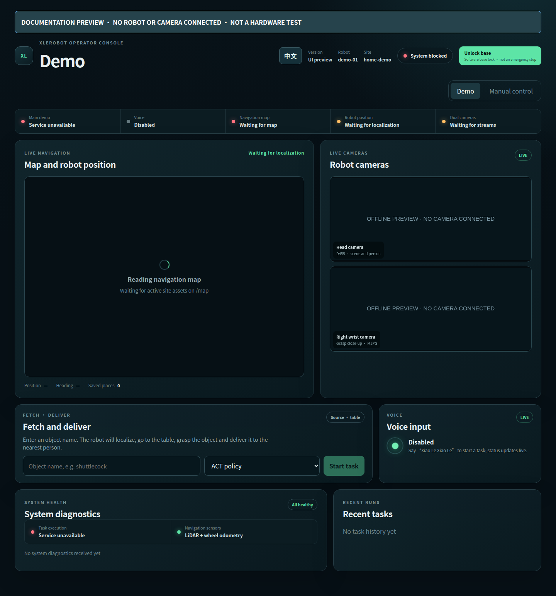

# Full voice + web demo

[Documentation](README.md) · Previous: [mapping](mapping.md) · [中文](../zh-CN/demo.md)

## Prepare once

Complete [installation](install.md), obtain [models](assets.md), activate/render
your unit's [calibration](calibration.md), and activate a [map with a table place](mapping.md).
Configure `site.map` and `site.places` to those files. A Leader is not required.
The full demo needs its person detector; voice needs local voice models and audio.

Place the requested object on the table within the calibrated grasp area,
clear the travel route, and stay beside the robot for the run.
The default target is `羽毛球`, using ACT. The weight was trained only on yellow
glue sticks; other-object performance is qualitative.

## Start each session

1. On GPU/Windows, start LM Studio, load the recorded Qwen model and enable
   its API server with an address reachable from Robot.
2. On GPU/WSL, start the inference services:

```bash
./tools/run gpu
```

3. Leave that terminal running. On Robot, with other mapping/collection
   workspaces stopped:

```bash
./tools/doctor robot
./tools/run demo --hardware
```

Resolve doctor errors first. The launch starts the robot stack and may perform
startup motions; it does **not** submit a fetch task automatically.

## Send a request

Open `http://<robot-host>:8080` (or `demo.web_port`).



*Layout only: no connected robot, map or cameras; the blocked status is expected
in this screenshot, not the required state for a real run.*

- **Web:** select **EN** in the top bar. Enter the object, select **ACT policy** /
  **Classical · centroid top grasp** / **Classical · GPD top grasp**, then click
  **Start task** when ready.
- **Voice:** say “小乐小乐”, wait for listening, then request the object.
  Voice uses the configured default backend; the web selector applies to web requests.
- **CLI:** from another Robot terminal, submit one backend-selected task:

```bash
./tools/run grasp act --hardware
```

The CLI object comes from `demo.object_id`. Change it in the local configuration
before submitting another CLI task. Avoid concurrent requests from voice, web and CLI.

## What completion looks like

```text
localize → navigate/dock → perceive → grasp and verify
→ find person → approach → speak → hand over → ready
```

Follow the current stage and final result on the page. A grasp alone is not
completion of the whole task. Task records retain both requested and actual
backend. Compare alternatives using [the grasp guide](grasping.md).

The **Manual control** tab offers localization, named-place navigation, base joystick
and posture presets. These are real motion commands, not required extra steps
for every automatic task. **Lock base** is a software base inhibit, not a physical
emergency stop or an arm stop.

## Stop

Cancel an active task from the page and wait for its result. Ctrl-C the Robot
terminal, then Ctrl-C the GPU terminal to stop both inference services.
LM Studio was started separately and can be stopped separately.
Support the arms and power down before leaving; if torque release reports a
communication error, do not assume the motors were released.

Before changing wiring, maps, calibration or controller configuration, stop the
running Robot workspace. See [troubleshooting](troubleshooting.md).
