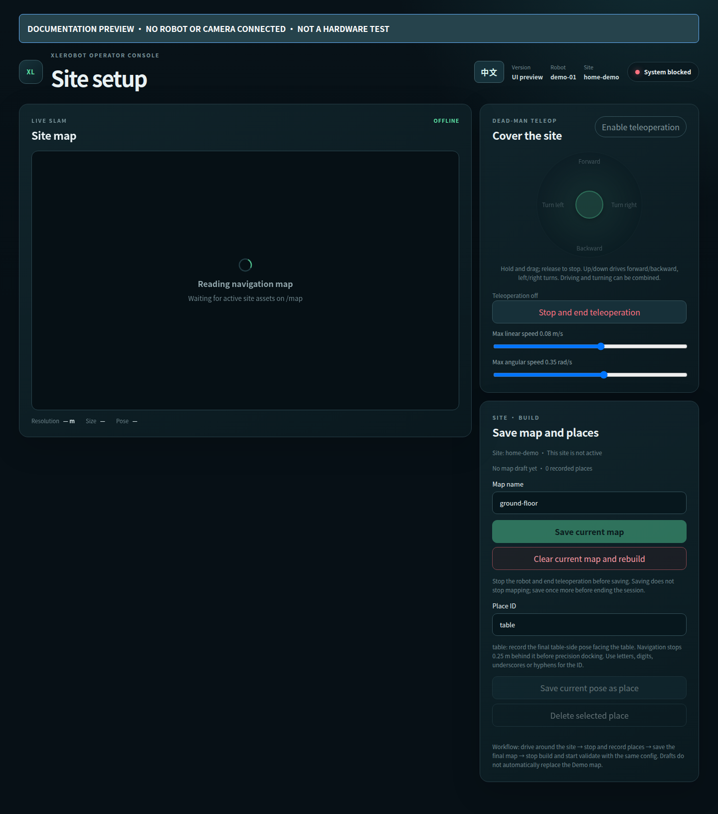

# Map the site and save places

[Documentation](README.md) · Previous: [calibration](calibration.md) · Next: [demo](demo.md)

A map describes **your site**, while calibration describes **your robot**.
The demo requires both. Complete and render the active calibration first.
Stop any running demo or collection workspace before starting mapping.

## 1. Build

On the Robot computer, with an operator beside the robot:

```bash
./tools/run mapping --hardware --phase build
```

Open `http://<robot-host>:8080`. If using `--config PATH`, use that same
configuration for build, validate and the later demo.

- Select **EN** in the top bar, then click **Enable teleoperation** and hold/drag the joystick.
  Up/down drives forward/back; left/right turns. Diagonal input combines both.
- Release the joystick to stop. Leaving the window ends teleoperation.
  Speed sliders set maximum linear and angular speed.
- Explore until the map covers the routes needed for the demo.



*Current frontend, offline layout preview. No real map, camera or robot connection.*

## 2. Record the table and save the map

1. End teleoperation and wait until stationary.
2. Position the robot at the final table docking pose, facing the table, then
   record the place ID **`table`**. Its orientation matters as much as position.
   Navigation first approaches a point 0.25 m behind this pose, then docks.
3. Record any other places you want. Selecting an existing ID lets you update
   or delete it; updates use the robot's current pose.
4. Save the map. Check the save time and saved-place list on the page.

Saving creates a **draft**, not the active demo map. You can continue mapping
after saving, but must save again to include later scans.

To restart mapping, stop teleoperation and confirm **Clear current map and rebuild**.
Only live SLAM is cleared; saved maps, places and demo configuration remain.
Unsaved map work is lost. Recheck or re-record place coordinates after rebuilding.

## 3. Validate and activate

Stop build with Ctrl-C, then launch the separate validation phase:

```bash
./tools/run mapping --hardware --phase validate
```

1. Run localization from the page; the robot can rotate.
2. Validate navigation to each saved place; the robot will move.
3. After the checks pass, activate the draft.

Do not run build and validate concurrently. Replacing the map invalidates its
navigation evidence; changing a place invalidates that place's evidence.

## 4. Point the demo at the saved site

Activated files are under
`<data.collection_root>/sites/<robot.site_id>/current/`.
For the example configuration, set:

```yaml
site:
  map: .xlerobot/artifacts/sites/home-demo/current/map.yaml
  places: .xlerobot/artifacts/sites/home-demo/current/places.yaml
```

Use the actual paths shown by your workspace, especially if you changed the
storage root or site ID. Activation does not silently edit the demo configuration.

Done means: the map is saved, `table` is listed with the correct pose, the
site passes validation and is activated, and these two configuration paths
point to it. Stop mapping before starting the [demo](demo.md).
