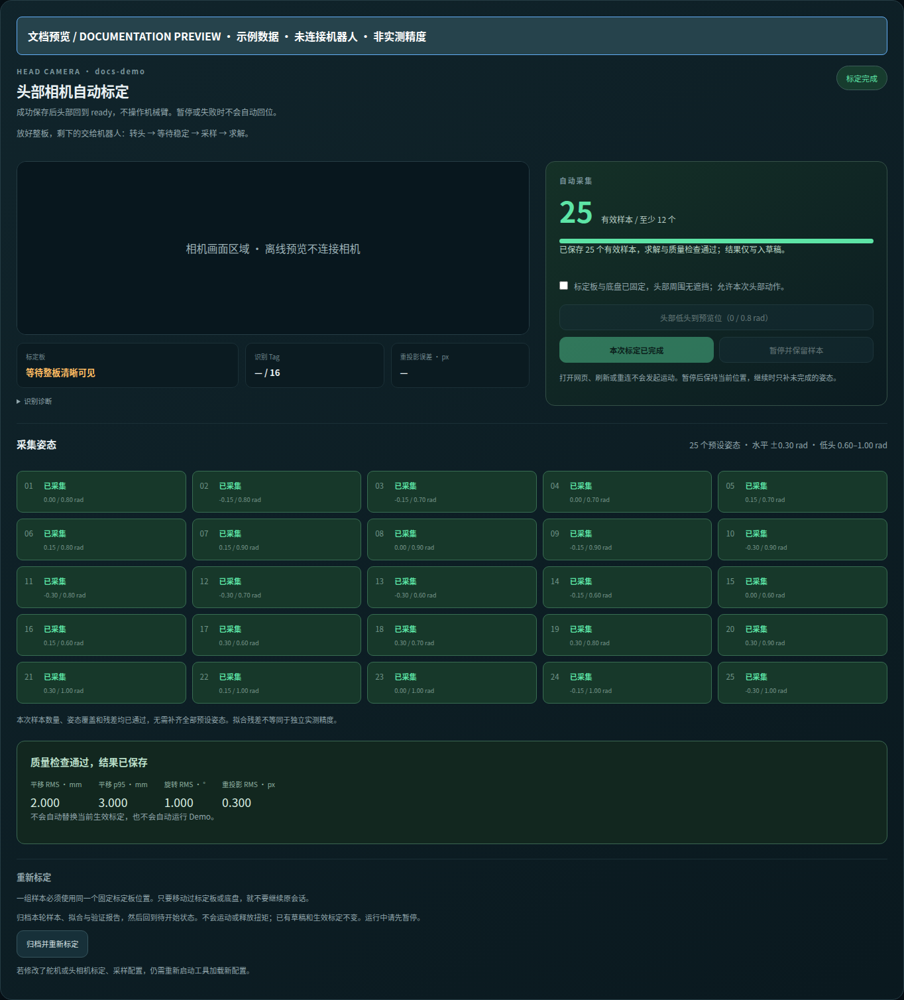
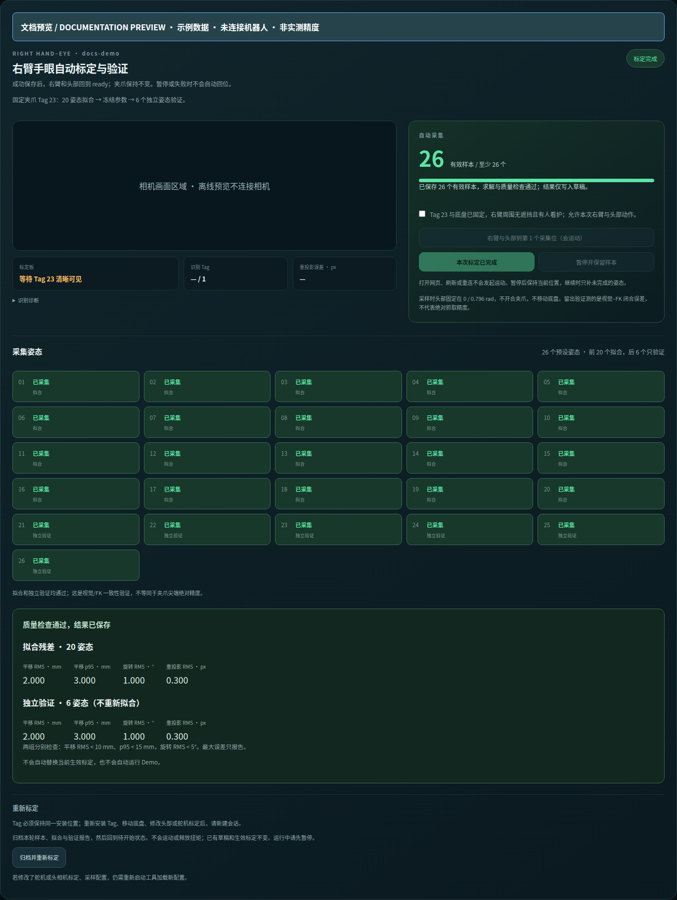
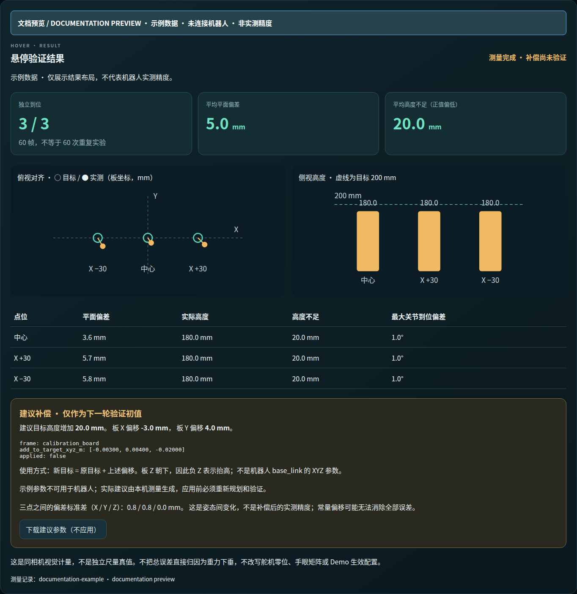

# 一个网页完成机器人标定

[标定总览](calibration.md) · [English](../en/calibration-workbench.md)

工作台围绕**右臂 Demo**组织：头部相机标定 → 右臂手眼 → 右臂悬停验证。
左臂舵机采集是附带工具，不代表左臂或双臂 Demo 已验收；Leader 为右臂数采的独立示教输入。

## 页面预览

以下是构建好的真实前端，使用**示例数据，不代表实测精度**；未连接机器人或相机。
[截图来源与生成方式](../images/README.md)。

| 头部相机自动标定 | 右臂手眼：拟合与独立留出验证 |
| --- | --- |
|  |  |

悬停页直接对比目标与实测位置，并生成尚未应用的偏移建议。下图数值仅用于展示，不能抄到机器人配置里。



## 启动

先完成 Robot 源码安装与 HMI 构建，准备 `config/local.yaml`。停止其他 Demo、
建图、数采或独立标定会话，再执行：

```bash
./tools/calibrate web --hardware
# 浏览器访问 http://<robot-host>:8080/
```

只查看与管理本机已有结果、不连接硬件：

```bash
./tools/calibrate web
```

可用 `--config PATH`、`--web-port 8083` 修改配置文件或网页端口。
工作台启动不打开设备；点击“启动此项设备会话”才运行原有 ROS 标定工具。
`--hardware` 只解锁设备会话，自动运动仍由具体步骤的开始按钮确认。
网页仅用于可信局域网，不要暴露到公网。

## 推荐顺序

| 页面 | 操作 | 结果 |
| --- | --- | --- |
| 从臂与头部 | 按原有零位 / 行程引导，完成并保存 | 从臂、头部舵机草稿 |
| Leader 主臂 | 独立进行六关节标定，可跳过 | 单独的数采用标定文件 |
| 头部相机 | 桌面完整 4×4 板；准备后点开始 | 头部运动采样、求解草稿 |
| 手眼标定 | 固定夹爪 Tag 23；准备后点开始 | 20 点拟合 + 6 点独立验证 |
| 悬停精度 | 桌面板与 Tag 23 同时可见；一键自动验证三点 | 对比图、逐点误差、待验证补偿建议 |
| 结果管理 | 结束设备会话；预览替换、应用或恢复 | 不可变版本与运行 YAML |

每一项结束后，点“确认完成并保存本项结果”保存草稿及前序版本关联。
头部相机标定成功后自动让头部回 ready；手眼标定成功后先右臂、再头部回 ready，夹爪保持不变。
使用与 Demo 共用的 `startup_ready.yaml` 目标。页面在回位期间显示“结果已保存 · 正在回 ready”，
回位成功才标记完成；失败或暂停不自动回位。若结果保存后回位失败，草稿保留并提示可检查后继续。
这不激活 Demo 配置。悬停测量无需这个按钮，报告自动保存。
切换标签只是浏览；现有操作页保持挂载，不因为刷新状态而中断操作。

更换设备会话需先点“结束设备会话”。**驱动关闭可能解除保持力，先放稳或支撑机械臂。**
工作台等待自己启动的进程组退出后才允许下一会话，遇到其他工具占用设备会报错，
不会自动杀掉其他 Demo 或接管其电机。

## 沿用与重做

从臂/头部与 Leader 页面都有“重新开始标定”按钮，保存后仍可使用：确认后归档整轮记录并重开同一设备会话。
尚未保存时，“重新采集这一组”只重置所选组；已经保存后，重做整轮使用顶部按钮。
视觉页面会在打开设备前检查旧采样是否匹配当前前序标定与姿态集；不匹配时直接提供“归档旧记录，开始新一轮标定”。
若启动姿态超限，设备会话区域会显示具体关节；托住相应部位手动摆回范围后，控制器自动继续加载。

- 已有通过的草稿：直接进入下一项，不必重做前序标定。
- 只有当前生效版本：用“使用当前生效结果作为草稿”；旧草稿先归档。
  若旧版本只有变换数值、没有可验证的视觉求解结果，则不能伪装成新标定通过，需要重新采集。
- 默认恢复已有采样，不删除记录。需要重做时，启动前勾选“归档旧采样，开始新一轮”。
- 如果姿态集或前序标定改变，旧采样不能直接续采；查看启动日志，归档后重做。
- 前序版本改变后，旧结果仍可查看，但提示需验证。历史结果没有前序来源时也不显示“整套有效”。

Leader 不阻塞视觉标定，也不进入从臂 / 头部结构标定包。其输出：

```text
.xlerobot/units/<unit>/capture/calibration_work/leader_servo/result.yaml
```

数采时显式传入：

```bash
./tools/act collect --hardware --leader-calibration PATH
```

## 悬停测量的边界

参考机器人已于 2026-09-09 完成头部相机 → 手眼 → 悬停全流程验收，
三个悬停点均通过网页执行并保存测量。**这是功能验收，不是精度达标声明。**
现在优先使用“一键启动并自动验证三点”：确认一次后，由机器人端依次准备、规划、
执行中心 / X+30 / X−30 三点，每点采 20 帧，最后回 ready 并生成结果。
网页刷新不打断机器人端任务；停止或失败时保留已完成的数据，不自动继续或回位。
一键编排已于 2026-09-10 在参考机器人完成三点测量及回 ready；补偿尚未应用或复测。
设备启动时页面自动等待服务；短暂连接失败恢复后提示自动消失，无需手动刷新。
若持续无法连接，查看设备会话日志。连接提示与操作错误分开，恢复连接不会抹掉操作失败原因。
先保持手眼标定时头部姿态（参考值 pan=0、tilt=0.796136 rad），不能转动相机后继续沿用固定 X。
手动排查时展开“单点调试”，从 ready 先点击“准备观测姿态（头部 / 右臂）”：复用手眼标定的第 4 个姿态，
低头并让 Tag 23 朝向相机。这一步需要明确确认；之后的“预览目标”仍然不触发运动。
Tag 安装方式必须和本次手眼标定一致。

桌面板允许部分遮挡，但同一图像中至少看见 3 个不共线桌面 Tag 和 Tag 23。
隐藏点位由板的已知几何推算，不沿用过期图像充当实时测量；头部相机标定本身仍要求完整 16 Tag。
观测临时过旧时最多等待新观测 1 秒；桌面稳定性分别检查平移 5 mm 和旋转 1°，
不混用变换矩阵元素的数值差作为距离。超出范围仍要求重新预览。

只提供板中心、板 X ±30 mm 三个高位目标，Tag 中心高度固定 200 mm。
预览不移动，检查关节限位、可达性、参考机械臂 / 腕相机包络与桌面间距；
桌面障碍物由图像时刻的头部标定 TF 定位，沿路径保留至少 50 mm 包络间距。
待验证的悬停目标仍由手眼 X/Y 生成：手眼拟合会吸收部分机械臂 FK 误差，
不能把它直接当成独立场景标定去检查延伸到肩部的桌面平面。报告保留两种桌面估计以便追溯。
这不是完整环境碰撞规划，其他障碍必须由现场操作人确认。
不可达或包络不足会明确失败，不改用未经检查的轨迹。
悬停点执行复用本地右臂 `FollowJointTrajectory` 控制器；准备和成功收尾回 ready 时调整头部，始终不操作轮子和夹爪。

一次移动后记录 20 帧静止观测，分别显示平面误差、高度不足（正值代表偏低）、三维误差、
视觉–FK 差异、五个关节到位偏差。20 帧不是 20 次独立到位，视觉测量不是独立尺量真值。
页面直接显示俯视位置偏差、侧视高度和三点表格，结束设备会话后仍能查看。
同一套标定、同一桌面场景的完整三点结果会生成**建议总偏移**：
每点先取 20 帧带符号三维误差的均值，再对三个点等权平均取负值。
参数为 `calibration_board` 坐标系的 `add_to_target_xyz_m`（米），按“新目标 = 原目标 + 偏移”使用；
板 Z 朝下，所以负 Z 表示抬高。不要把它当成 base_link 偏移或加在测量结果上。
页面可下载建议 JSON，但不会应用；改变标定版本后旧建议会标为失效。
这不是经过补偿复测的结论，也不能从三点静止数据把误差拆成
`vision_fk_compensation_m` 和 `gravity_sag_z_m`。不自动改写这些参数或手眼结果。
建议仅适用于同一 Tag 安装、负载、头部姿态及附近高位点，不能直接用于 ACT。
实际采用时须重新规划、检查路径并进行补偿后复测。

报告保存在 `.xlerobot/units/<unit>/capture/calibration_work/hover/<id>.yaml`。
三点汇总保存在 `hover/runs/<run-id>.yaml`，最新面板索引为 `workbench/hover_latest.yaml`。
工作台来源记录和会话日志保存在同一 unit 下的 `workbench/`。

## 应用与恢复

“结果管理”选择要替换的草稿和新版本名称，先预览，再应用；未选部分沿用当前生效版本。
更换了上游参数，需要验证下游结果，不能仅凭各项单独质量通过就声称混合配置精度合格。
首次复现没有旧版本时，仍需准备完整五项 bundle 才能激活，不能凭空补齐底盘或抓取补偿。

版本恢复会同步重新生成 runtime；不会热更新已经运行的 ROS 节点。
详细文件含义和命令见 [配置替换与恢复](calibration-versions.md)。
底盘、雷达及可选抓取对齐见 [后续标定说明](calibration-followup.md)。
原有 `tools/calibrate capture ...` 命令继续保留，供独立排查使用。
