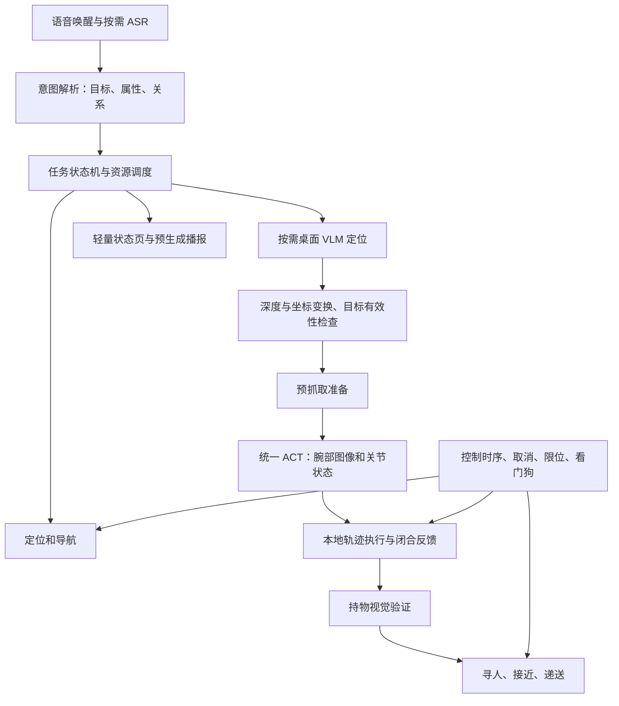

# X1 家庭服务 Demo 的负载、端侧推理与系统优化研究

建议路线是：先让 X1 稳定接管整条机器人控制链，再把同一个 ACT 策略迁到端侧，随后用低频调用的端侧 VLM 承担意图解析、桌面目标定位和抓取结果判断。优化的主要对象是常驻计算、图像数据流、任务调度与控制时序；开放物品识别、简化的语音交互和统一 ACT 抓取策略属于保留能力。

本报告形成于 2026-09-15，依据当前机器的只读检查、源码与部署权重检查、短时负载采样，以及厂商和上游项目资料。文中的资源预算、成功率和延迟门槛是建议验收目标，均不是已经达到的实测成绩。本轮没有更换推理后端、安装新模型、修改实时调度或执行新的机器人动作。

**一、目标与边界**

X1 要替代笔记本作为主控，采用原生 Ubuntu 22.04 / ROS 2 Humble。当前机器人、地图和标定继续沿用；训练、导出模型和离线分析仍可在外部工作站进行，最终运行所需的能力逐步留在 X1。

“能砍尽砍”并不等于把需求收缩成固定清单。机器人仍应理解开放的取物指令、在变化的桌面上识别新物品，并由同一个 ACT 策略执行抓取。语音唤醒和交互保留，可以减少闲聊、多轮上下文和冗长播报。VLM 的职责限于三项任务，无须为当前 demo 建设通用视觉聊天系统。

| 保留的目标 | 可以收缩的实现范围 |
| --- | --- |
| 开放物品名称与属性描述 | 动作接口仍限制为现有取物、递送、取消等能力；物品字段不设封闭白名单 |
| 同一个 ACT 抓取不同物品 | 保持当前腕部视觉和关节输入，先验证迁移数值一致性，再讨论模型压缩 |
| 变化的桌面与摆放 | 保留目标定位、深度、坐标变换和执行前验证，不依赖固定物品坐标 |
| 语音唤醒及必要交互 | 单次指令、必要澄清、简短播报；后台不持续运行大 ASR 或语言模型 |
| 可靠导航与交付 | 保留定位、避障、取消、持物检查；工程调试和视频展示可以移出运行模式 |

统一 ACT 是设计约束。权重的训练数据名称不能代替泛化能力测试，也不能据此把可抓物品限定为某一类别。另一方面，开放识别不代表任何尺寸、材质和摆放都在机械能力范围内。验收要记录真实的泛化范围，并对无法确定或不可达的目标给出澄清或失败结果。

**二、实机证据：现在主要卡在哪里**

在没有新任务执行、没有编译或推理压测的情况下，独立的 10.03 秒采样得到以下数据。原始数据保存在本机忽略目录 `.xlerobot/environment/x1-research-20260915/idle-baseline.json`，不纳入 Git。

| 指标 | 本机结果 | 解释 |
| --- | --- | --- |
| CPU 可见数量 | 6，possible / present / online 均为 0–5 | 不是只把八核中的两核设为 offline；当前不能按八核安排预算 |
| 整机忙碌比例 | 95.54% | 六个可见核心的总体时间占比 |
| 用户态 / 内核态 | 44.67% / 37.13% | 不能把瓶颈只归因于神经网络算术 |
| 硬中断 / 软中断 | 7.17% / 6.56% | USB、网络、调度相关路径需要继续归因 |
| CPU pressure，60 秒 some | 68.36% | 大量时间存在等待 CPU 的任务；不等于 68.36% CPU 使用率 |
| 1 分钟 load average | 25.76 | 包含可运行和不可中断等待任务，不等于 2576% CPU |
| 内存 | 约 14 GiB 可见，约 10 GiB available | 此时内存容量不是首要瓶颈；端侧 VLM 的峰值另测 |
| Swap | 当时使用量为 0 | 暂无证据把当前卡顿归因于换页 |
| CPU 调频 | performance，三组频率约 2.016 / 2.803 / 3.187 GHz | 已不是省电频率配置，不能期待切换 governor 就解决问题 |
| CPU 温度传感器 | 单次读取约 62–77°C | 需要持续热稳态测试；这次读数本身不能证明已经降频 |

| 进程职责 | 本次 CPU，占一个核心的百分比 |
| --- | ---: |
| 任务调度 | 52.13% |
| ACT 适配器，推理仍在远端 | 37.78% |
| 寻人检测器 | 36.58% |
| 桌面物品检测器 | 35.99% |
| 网页界面，预览已降为 3 fps | 30.30% |
| 腕部相机发布 | 29.01% |
| ros2_control | 22.73% |
| 寻人动作编排 | 21.83% |
| 抓取验证 | 16.55% |
| D455 驱动 | 12.86% |

这些是进程 CPU 时间，不是各功能独立造成的整机负载。图像发布、订阅、DDS 和内核处理存在耦合，不能直接把“关闭一个功能”的收益等同于其进程占用，也不能把多个短时实验的收益相加。

此前的短时对照中，暂停腕部图像发布使整机忙碌比例从 95.6% 降到 86.7%，恢复后相机继续工作。这支持优先调查图像路径，但还不是长期、重复、随机顺序的消融试验。网页预览从 10 fps 降至 3 fps 后，网页进程约从 38% 降到 30%；仅此不足以恢复整机余量。任务节点改用 raw 图像订阅后的占用在复测中仍约 52%，不能把它算成已验证的优化收益。

一个 5 秒的任务节点 syscall 统计中，futex 和 recvfrom 的累计 syscall 用时分别约占 61.8% 和 31.7%。这里包含阻塞等待，且 strace 会扰动被测程序，不能解读为“61.8% CPU 消耗在锁上”。它说明应继续测执行器唤醒、锁竞争和消息接收，而不是立即重写全部 Python。

更直接的稳定性问题已经确认：ros2_control 启动日志报告申请 FIFO 实时调度失败，原因为权限不足；实查控制进程的线程均为普通 TS 调度，实时优先级额度为 0。日志中也出现过 Nav2 未达到 20 Hz 控制频率的警告。Humble 的 controller manager 官方说明其尝试使用 FIFO 优先级 50，目标是降低控制周期抖动。当前部署未满足这一条件。[1](https://control.ros.org/humble/doc/ros2_control/controller_manager/doc/userdoc.html)

本次抓取失败还暴露了应用层问题：策略流完成与夹爪实际闭合不是同一事件；抓取验收曾允许明显张开的夹爪通过，后续递送才拒绝。上一轮已经增加闭合补齐和开度门控，软件测试通过，但没有新的实机成功率证据。CPU 过载可能恶化执行时序，却不能代替对该逻辑错误的解释。

**三、硬件加速条件比“48 TOPS”更重要**

AidLux 的 X1 官方规格列出 QCS8550、Adreno 740、16 GB 内存和约 48 TOPS INT8；官方 CPU 规格为八核。本机内核实际只暴露六核，应该向厂商核实当前固件的 CPU 拓扑，而不是直接按宣传规格规划算力。TOPS 不能换算成 ACT 帧率或 VLM 响应时间。[2](https://developer.aidlux.com/software/x1)

| 检查对象 | 已有证据 | 尚未证明的内容 |
| --- | --- | --- |
| GPU / DSP 设备 | 存在 KGSL 与 adsprpc 设备，当前用户属于 system 组 | 具体模型正确卸载及长时间稳定执行 |
| QNN | 已有 2.36、2.40、2.48 相关库；AidLite SDK 及 QNN 插件已安装 | 某个导出模型与指定库、固件组合兼容 |
| AidLite | Python 导入和版本查询成功 | NPU 推理延迟、峰值内存、算子回退情况 |
| 当前机器人 ONNX Runtime | 1.23.2，仅列出 CPU 与 Azure EP | 当前环境没有可直接使用的 QNN EP |
| OpenCV | OpenCL 查询可用且启用 | 现有 NumPy / Mat 图像操作是否实际使用 GPU |
| 端侧 VLM 资产 | 已有 QCS8550 的 Qwen3-VL-4B 448×448 QNN 2.40 配置、模型分片、视觉编码器和 embedding 资产 | 模型资产存在不等于服务可用；本轮未完成推理验证 |

已有 Qwen3-VL 资产约占 4 GiB 磁盘，其中 FP32 embedding 文件约 1.5 GiB。不能据此推断只需 4 GiB 运行内存：KV cache、激活、共享缓冲、映射页面以及厂商运行时都需要单独测量。

本机厂商 API 配置指向端口 8888，检查时未见该端口监听。本轮没有为测试启动它或改动既有模型服务。另一个需要修正后再验证的细节是已有 Genie 配置使用 `cpu-mask=0xe0`：它包含 CPU 5、6、7，而当前可见核心只有 0–5。配置还开启了 polling，应测其延迟收益与 CPU 代价，不能直接沿用面向另一拓扑的参数。

建议首先使用厂商已提供的 AidLite / AidGen C++ 或 Python 接口验证一条小模型 NPU 路径，再验证已有 VLM。厂商资料提供 Linux 下的 QNN 推理和面向 QCS8550 的 VLM 使用路径，这是可行性线索，而不是本机性能保证。[3](https://docs.aidlux.com/en/software/ai-sdk/aidlite_guide)、[4](https://docs.aidlux.com/en/software/genai-sdk/aidgen/aidgen_guide)

ONNX Runtime QNN 的旧文档与新独立 EP 文档存在平台和版本差异。新项目提供 Linux ARM64 构建路径，但不能据此在现有 ROS Python 环境直接替换 onnxruntime。应锁定 Python、glibc、ORT、QAIRT、固件及模型编译版本，在独立推理进程中验证。[5](https://github.com/onnxruntime/onnxruntime-qnn/blob/main/docs/execution_providers/build.md)、[6](https://github.com/onnxruntime/onnxruntime-qnn/blob/main/docs/execution_providers/QNN-ExecutionProvider.md)

**四、先裁剪工作方式，再裁剪模块**

| 项目 | 建议处理 | 对开放 demo 能力的影响与依赖 |
| --- | --- | --- |
| ACT 的头部图像订阅与 HTTP 编码 | 按当前权重契约删除这一输入依赖 | 当前模型只有 wrist + state，不损失模型输入；同步检查、测试和健康门控须一起调整 |
| 任务节点订阅完整 RGB / depth | 改收相机状态、帧序号、采集时间和错误信息 | 保留传感器可用性判断；单纯 raw=True 仍保留消息流，收益不足 |
| 检测、验证、ACT 常驻图像消费 | 按任务阶段启停订阅，模型可预热驻留 | 保留所有能力，降低空闲开销；切换后必须获取新帧 |
| 网页视频和 JPEG 编码 | 默认关闭，显式查看时低帧率启用 | 保留启动、取消、状态和错误；无观看者时不编码 |
| 标定、数采、建图、训练管理 UI | 从正式 demo 启动组合中排除 | 工具仍可单独运行；目前部分工程 UI 已关闭，不能重复计算收益 |
| 调试图、voxel 可视化、全量 costmap 发布 | 无消费者时关闭或降低发布频率 | 先裁掉展示数据，保持内部避障更新和真实障碍信息 |
| 当前 3D voxel 层 | 评估替换为 2D obstacle 层 | 当前仅输入 LaserScan；须验证标记、清除和障碍边界等价后替换 |
| 大 ASR | 唤醒后才工作，限定线程、比较中文模型 | 开放物品名称保留，不能用固定关键词识别替代全部语音理解 |
| TTS | 常用播报预生成 PCM，动态文字按需合成 | 新物品仍可通过动态路径播报；动作阶段不实时解码长音频 |
| 人体检测 | 仅寻人阶段启用，优先评估 NPU 小检测器 | “人”是稳定类别，适合专用模型；仍保留寻找收件人的能力 |
| MoveIt | 初期保留，减少展示与非必要发布 | 不先冒险重写已存在的 IK / 规划；场景变化仍需要执行前检查 |
| GPD / SAM 等备用抓取路径 | ACT 正式演示模式不加载其额外运行依赖 | 保留源码与离线工具；不能假定当前 CPU 开销主要由远程服务造成 |
| 左臂相关功能 | 停用无关业务，评估低频监测 | 头部与左侧总线存在耦合，不能把整条总线直接停掉 |
| 定位、碰撞监测、看门狗、关节反馈 | 保留并保障调度 | 不能以去掉失败检查来提高表面成功率 |

源码入口包括 `fetch_deliver_demo.launch.py`、`fetch_deliver_task_node.py`、`act_policy_node.py`、`act_http.py`、`operator_console.py` 以及 `nav2_two_wheel_reference.yaml`。目前导航局部 voxel 层只使用 `/scan`，同时开启 voxel map 发布和完整 costmap 发布，是值得单独测量的裁剪项。

**五、按阶段分配资源的运行结构**

建议维持现有公开工具和主要 ROS action 接口，只重构内部资源使用，不另建通用机器人框架。运行结构分为控制、视觉/推理、交互与任务三个部分。控制侧不等待 HTTP、图像编码或大模型；任务侧接收结构化结果；重推理按阶段串行安排。

| 阶段 | 必须工作的重模块 | 应休眠或不订阅的模块 |
| --- | --- | --- |
| 等待 | KWS、控制与安全状态、必要定位状态 | ASR、桌面 VLM、ACT 图像消费、人体推理、视频编码 |
| 听取与理解 | ASR，随后文本意图解析 | ACT、视觉验证；重推理不同时抢占资源 |
| 导航 | Nav2、雷达、里程计与安全控制 | 腕部推理、桌面 VLM；头部相机处理按实际消费者需求决定 |
| 到桌边找物 | 一次新鲜 RGB-D 快照、VLM、深度与 TF | ACT 推理先不运行，人体检测不运行 |
| 抓取 | 腕部采集、ACT 和本地执行器 | 桌面 VLM、人体推理、网页编码；保持底盘停止监测 |
| 抓取验证 | 新鲜腕部图像和实测夹爪状态 | ACT 推理释放算力，VLM 获取一次或少量视角 |
| 寻人与接近 | 头部 RGB-D、人体检测、导航 | ACT 和桌面 VLM |
| 交付 | 持物检查、递送控制和短播报 | 通用视觉推理，除非检测到异常 |

模型驻留与模型运行要分开。反复加载数 GiB VLM 会产生冷启动和内存抖动；可以驻留，但必须确认其空闲时没有忙轮询。摄像头也不宜在每个阶段反复 USB 断开重连。优先停止无用订阅、处理与发布；是否进一步暂停物理采集，要测恢复延迟和首帧时间。

健康状态必须跟着重构。建议区分“设备已连接”“当前阶段要求采集”“当前数据新鲜”，只有进入阶段后才要求对应新帧。否则把相机按需启用后，旧的全局新鲜度规则会一直把 demo 判为未就绪。取消、异常退出和阶段超时都应释放资源，并丢弃旧任务返回的结果。

**六、ACT 端侧迁移：保持同一策略行为**

实际部署权重的配置与 safetensors 头部已在推理主机读取，未运行新的推理或机器人动作。结果如下：

| 项目 | 当前权重 |
| --- | --- |
| 视觉输入 | 仅腕部 RGB，3×480×640 |
| 状态 / 动作 | 各 6 维，包含夹爪 |
| 输出动作块 | 100 步 |
| 视觉骨干 | ResNet18 |
| Transformer | dim 512，8 heads，4 层 encoder、1 层 decoder |
| 权重张量元素总数 | 约 51.67M，含训练时 VAE 相关张量 |
| 去除 VAE 名下张量后的元素数 | 约 34.24M，只是静态统计，不是导出图的最终参数证明 |
| 当前执行与请求 | 30 Hz 动作流、最高约 3 Hz 推理请求 |

ACT 原始方法在推理时不使用训练阶段的 VAE encoder。[7](https://tonyzhaozh.github.io/aloha/) 因此导出应明确固定推理路径；剔除未用张量可以减少部署资产，但不能把它宣传为对当前已经跳过 VAE 的推理加速。

当前适配器仍同步 head、wrist 和 state，HTTP 客户端也编码两张图；服务端则只根据权重的 input_features 解码 wrist。这是明确的数据契约冗余。应先解除 head 输入耦合，保持腕部尺寸、颜色通道、归一化和物理动作单位不变，再测传输和 CPU 收益。

统一 ACT 没有文本目标输入。目标选择通过 VLM 定位、机器人预抓取位姿和腕部视野共同传递给策略。开放物品下尤其要保证选中的目标进入正确视野；多物体干扰、相似物体和预抓取偏差应成为测试场景，而不是先改成按类别切换多个策略。

建议按以下顺序迁移：

1. **冻结现有行为基线。** 固定权重、归一化文件、关节顺序、帧处理、动作块合并和夹爪 governor，记录相同输入的原始浮点输出。
2. **导出静态推理图。** batch=1，保留 480×640 和 6 维 state，输出 100×6。检查 LayerNorm、注意力、reshape、位置编码和实际支持的算子，先做浮点一致性。
3. **依次评估部署路径。** 优先尝试完整 QNN/HTP 图；若不支持或回退明显，再评估 QNN GPU，或 NPU backbone + CPU decoder 的拆分。拆分必须计入中间张量搬运和同步开销，不能只看各段执行时间。
4. **最后量化。** 使用实际腕部和关节分布做量化校准，重点检查接触阶段、动作反归一化和夹爪闭合时刻。W8A8、W8A16、FP16 等只在该后端与图确实支持时比较。
5. **影子推理后接管。** 先让端侧输出参与离线或旁路比较，不发送控制命令；达到误差与延迟门槛后再接入本地执行器，保留远程回退版本。

Qualcomm AI Hub 的 ACT 模型页列出 ACT 和 QCS8550 Proxy，但该页面的型号筛选信息存在不一致，且公开模型结构与本机权重不同。本报告不引用它作为本机可达帧率、算子全覆盖或直接可部署的证明。[8](https://aihub.qualcomm.com/models/act)

30 Hz 控制不要求每 33 ms 跑一次完整 ACT；动作块由本地执行器连续消费。反过来，100 步约覆盖 3.33 秒，也不意味着可以每 3 秒才看一次新图。当前 3 Hz 请求、60 步队列和 15 步补充阈值共同决定反馈新鲜度，不能为了端侧跑得动而直接把抓取变成长时间开环。

建议初始目标为整条“采集到可用动作块”的 P99 小于 300 ms，并证明不会耗尽当前约 500 ms 的 15 步储备；这只是基于现有配置的候选门槛。最终还要包含排队、预处理、推理、输出转换及动作块合并的时序。若不能满足，先保留远程 ACT，不用降低动作控制频率掩盖延迟。

**七、端侧 VLM 的三项职责应分别验收**

“达到 VLM 同样的效果”可以具体定义为下面三个输出合同，而不是比较聊天是否流畅。

| 职责 | 必须产出的结果 | 主要失败风险 |
| --- | --- | --- |
| 意图解析 | 动作、开放目标名称、属性/关系、来源/收件信息、是否需要澄清 | 听错物品、忽略否定或修饰、凭空补充对象 |
| 桌面目标定位 | 与原图对应的目标框或候选区域、对象匹配结果、找不到或歧义状态 | 小目标丢失、同类混淆、坐标格式错误、缩放映射错误 |
| 抓取结果判断 | 抓住/未抓住/不确定，并与实测夹爪和图像时间关联 | 看见物体却误以为物体在夹爪里、遮挡、空爪假阳性 |

例如“把桌子左边那个红色杯子拿给我”应保留“左边”“红色”等限定。如果有两个同样匹配的杯子，应澄清。开放语言输入最终映射到已有能力接口；模型不能直接生成电机命令。

**候选 A：一个端侧 Qwen-VL，按阶段处理三项任务。**

这是当前最值得先验证的路线。已有 QCS8550 适配的 3B / 4B 资产与厂商 SDK 可以减少部署准备；意图阶段走文本输入，桌面定位与抓取验证才走视觉输入。它们在任务流程中本来就是低频、分阶段发生的，可以和 ACT 错峰使用 NPU。

需要测清：模型是否实际使用 HTP、冷/热启动、视觉编码时间、首 token 与完整结构化结果时间、上下文清理，以及输出坐标合同。限制输出为短 JSON，关闭无关长推理和聊天历史，设置超时和结构校验。不要把 token/s 当成定位服务延迟，也不要把模型自报 confidence 当作经过校准的成功概率。

已有端侧模型的 448×448 输入，与当前远程请求把图像长边放大到 1280 的处理方式不同。先比较全图定位；对小物品或歧义区域再做少量 ROI 高细节复核，保留所有裁剪、缩放坐标到原始 RGB-D 的映射。不能把输入缩小后未经评估的框直接送去抓取。场景变化时重取新图，不复用桌面坐标缓存。

**候选 B：轻量文本模型解析意图，VLM 只处理两项视觉任务。**

如果 A 的文字解析延迟、驻留开销或调度不理想，再评估本机已有的小语言模型。常见明确句式可走确定性解析，其余仍保留开放语言路径。拆成两个模型会增加进程、内存、模型切换和维护成本，因此不能仅凭参数量更小就认定更省资源。

**候选 C：开放词汇检测器负责常规定位，VLM 处理复杂描述和抓取验证。**

YOLO-World 提供基于文本 embedding 的开放词汇检测及部署路径，词汇可由当前指令生成、编码一次后复用，而不必固化成物品白名单。[9](https://github.com/AILab-CVC/YOLO-World)、[10](https://github.com/AILab-CVC/YOLO-World/blob/master/docs/prompt_yolo_world.md) 它适合降低重复定位的成本，但不能自动替代复杂空间关系理解或持物判断。QCS8550 上的转换、动态词汇输入和中文描述处理仍需要独立验证，公开桌面 GPU 成绩不能代替本机结果。

建议先比较 A 与现有远程基线，只有发现明确短板才引入 B 或 C。过早叠加小 LLM、开放词汇检测器、分割器、VLM 和多个常驻服务，可能使系统更重。封闭类别 YOLO 可用于“人”检测，但不足以承担开放桌面物品识别。

**八、抓取成功判断不能只依赖夹爪开度**

闭合位置是必要的动作执行证据，不是持物证明。全闭可能是空爪，小开度可能是物体，也可能是机构或控制误差。VLM 看见桌面上的目标也不等于抓到了。当前硬件读取路径主要提供位置及派生速度，不能假装已经有可用的力、触觉或校准后的夹持电流。

建议验证流程是：确认闭合动作已经执行；抬离桌面后采集新鲜腕部图像；检查目标是否位于夹爪持物区域、是否与夹爪存在一致运动；不确定时进行一次受限的二次观察，再决定重试或失败。移动观察本身需要现有运动门控和有效空间检查，不能为了验证随意甩动物体。

如后续考虑舵机电流/负载信息，先确认型号、可读寄存器、频率、标定和附加串口代价。它是额外证据，不直接等同于夹持力。近期可用的路线仍是位置反馈加视觉证据。

当前抓取和递送共同使用的 0.15 rad 持物上限来自现有 demo 假设，不能成为“抓各类物品”的普遍规则：较大物品可能使夹爪在更大开度停止。正式泛化版本应检查闭合指令、实测响应、物体几何与视觉持物证据，并保持机械限位；对无法判定的状态输出不确定。新方案和数据验收完成前不直接调大阈值放行。视觉阴性被“小开度”覆盖的规则也应重新评估，避免以一种误判替换另一种误判。

**九、语音保留，持续负载与等待时间分别优化**

保留当前轻量 KWS；唤醒后才执行 VAD、录音、ASR 和意图解析。KWS 的“开放关键词”是可配置唤醒词，不代表能识别任意完整指令，不能因此删掉 ASR。[11](https://k2-fsa.github.io/sherpa/onnx/kws/index.html)

当前 Whisper small / int8 使用 4 个 CPU 线程，先测完整短指令的识别延迟和物品名称错误率，再比较中文 SenseVoice / Paraformer 等路径。sherpa-onnx 提供 Linux ARM64 的 SenseVoice 支持；AidVoice 也提供面向 QCS8550 的语音推理路径。可分别建立 CPU 与 NPU 基线，但没有本机数据前不能保证替换后的速度或精度。[12](https://k2-fsa.github.io/sherpa/onnx/sense-voice/index.html)、[13](https://docs.aidlux.com/en/software/aidvoice/aidvoice_guide)

固定播报保存为预解码 PCM，在动作阶段优先直接播放；开放物品名和澄清语句保留动态 TTS，但安排在动作开始前完成。测音频 underrun 和长句流畅度，不能仅凭一条短句通过就认定整条播报链已经稳定。

ASR、意图模型、桌面 VLM、ACT 通常可以按阶段错峰。唯一需要持续保证的是取消与停止通道；若使用口头停止，也必须在动作期间保留独立、低延迟的识别路径，不能依赖此时被暂停的大 ASR / VLM。

**十、底层优化的顺序与边界**

第一步是减少数据流。640×480 的 RGB 单帧约 0.92 MB，16 位深度约 0.61 MB；按 RGB-D 15 fps 和腕部 RGB 10 fps 估算，三路源数据约 32.3 MB/s，尚未包含多订阅者、序列化、复制和协议开销。这是按尺寸计算的有效载荷，不是实测网络带宽。回调里丢帧仍然可能已经付出传输和反序列化成本，应在源头或订阅关系上减少无用数据。

第二步是收敛图像热路径。优先使用同进程 C++ 相机/视觉组件或明确所有权的最新帧缓冲，任务状态机仍可保持 Python。头部快照、腕部 ACT、网页预览各自使用合适的数据出口。只保留少量最新帧，旧帧超时丢弃，不依靠无限缓存来“稳定”。ROS 2 Humble 的进程内通信示例提供了减少图像复制的路径，但仅把多个 Python 节点放进同一进程不会自动获得相同效果。[14](https://docs.ros.org/en/humble/Tutorials/Demos/Intra-Process-Communication.html)

第三步才是 DDS 和 IPC。实查当前加载 Fast DDS 2.6.12，进程环境设置了 UDPv4；磁盘上也有共享内存相关文件，因此还需通过实际数据通道测量确认传输方式。共享内存 transport、DDS data-sharing 和端到端零拷贝不是同一个保证。Fast DDS 2.6 的零拷贝有 plain/bounded 类型等限制，而标准 Image 含动态数组和字符串，不能靠一个开关就断言跨进程全零拷贝。[15](https://fast-dds.docs.eprosima.com/en/2.6.x/fastdds/use_cases/zero_copy/zero_copy.html)、[16](https://docs.ros.org/en/humble/p/sensor_msgs/msg/Image.html)

在隔离的回放环境对照当前 Fast DDS、正确配置的共享内存以及其他已验证 RMW，逐项测 CPU、复制量、延迟和丢帧。不直接更换正在控制机器人的整个通信栈。端侧推理初期可保留现有数据服务合同，随后再替换本机 JPEG/base64 为有界二进制或共享帧接口；控制命令仍只在控制进程产生。

第四步是控制调度。通过受控的服务权限让 controller manager 的指定实时线程成功获得其请求的优先级，验收线程实际调度类别和周期。不要把整个 AI 进程提升为 FIFO。根据大/小核实测分配控制、USB/串口相关线程和推理线程，先比较绑核与不绑核，再决定 CPU affinity；不能直接套用八核样例掩码。

第五步检查控制循环中的动态分配和阻塞。当前总线读路径每次创建多个 vector，适合评估预分配和复用；同时测串口批量读写和超时。预分配能降低抖动风险，但不能在没有 profile 时宣称是最大 CPU 热点。ROS 实时资料明确要求关注内存分配、缺页与不可控阻塞。[17](https://docs.ros.org/en/humble/p/pendulum_control/)

最后才考虑系统大改。当前已经使用 performance governor，应先观察温度、频率和持续运行后的尾延迟。厂商内核承载相机、音频、GPU 与 DSP 驱动，不宜为了实时性直接换通用内核。若经过数据流与调度优化仍达不到控制时序，再与厂商核实可用的实时内核和固件支持。降低负载不应以破坏现有驱动为代价。

**十一、验收应该测什么**

以下是讨论用的初始门槛，需由基线数据确认是否合理。它们不改变当前 watchdog、限位或碰撞阈值。

| 层级 | 建议指标与初始门槛 |
| --- | --- |
| 静态待机 | 目标整机 CPU ≤35%，连续 30 分钟；温度、频率和内存无持续恶化 |
| 活跃阶段 | 目标大部分时间 ≤70–75%，允许短峰值，但不得导致控制 deadline 连续失守 |
| 50 Hz 硬件循环 | 分别记录读、更新、写和调度延迟；候选 P99 超期 ≤5 ms，不能只看平均 50 Hz |
| 30 Hz ACT 执行 | 队列耗尽、过期动作和失控续播为 0；记录每段动作来源与执行反馈 |
| ACT 端到端推理 | 候选 P99 <300 ms；采集、排队、预处理、推理、反归一化、合并全计入 |
| ACT 数值迁移 | 建立原始关节单位误差分布、最坏偏差和闭合时刻偏差；阈值由机械容差与浮点基线确定 |
| 语音 | 以真实中文取物句测唤醒召回、误唤醒、物品/属性错误率；候选唤醒应答 <0.5 s，指令结束到确认 P95 <2 s |
| 桌面定位 | 候选 P95 <3 s；另测选错对象、没找到、歧义澄清和 3D 点误差，不能只看框 IoU |
| 抓取验证 | 优先约束空爪被放行为成功；候选 P95 <2 s，遮挡允许输出“不确定” |
| 整体任务 | 先做 10 次连续内部验证，再至少 30 次变化场景验收；建议目标 ≥27/30，按对象和阶段分别报告 |
| 持续运行 | 1 小时重复任务/回放负载，无内存增长、热降频引起的尾延迟失控和音频 underrun |

有限测试不是“抓一切”的统计证明。测试集应覆盖新物品、相似物品、不同材质尺寸、遮挡、杂乱桌面、位置变化和光照变化，并记录不支持的物理条件。不要把同一静止场景的连续视频帧当作大量独立样本。

抓取验证尤其要建立空爪、物体仍在桌面、夹住后掉落、只夹到边缘、遮挡等负例。若希望声称空爪误放行率低于 1%，仅做几十次零失误远远不够；在独立同分布的简化假设下，约 300 个独立负例零失误，单侧 95% 上界才接近 1%。该计算不能替代对场景多样性和样本相关性的审查。

当前还没有各阶段的受控基线，CPU 表来自待机，不能外推到抓取、语音识别或端侧 VLM 并发峰值。下一轮应建立软件回放工况与实机工况两套记录，分开分析模型误差、控制误差、定位误差和感知误差。

**十二、从调研到实施的分阶段计划**

| 阶段 | 工作内容 | 进入下一阶段的条件 |
| --- | --- | --- |
| R0：冻结基线 | 保存版本与配置引用；整理阶段时序；建立 CPU/内存/调度/图像年龄/音频记录；核实六核拓扑与厂商运行时 | 能复现问题，能解释指标含义，测试不触发真实电机 |
| R1：稳定替代笔记本 | 解除 ACT 头图依赖；按阶段管理订阅；轻量健康消息与状态页；修复实时调度；处理导航/抓取已有失败链 | 现有远程推理下完成变化场景任务，控制时序和热稳态达标 |
| R2：端侧加速探路 | 用已知小模型验证 AidLite/QNN 后端；离线试运行已有 VLM；准备 ACT 静态导出和一致性回放 | 模型实际卸载、版本组合、峰值内存和延迟均有证据；不接管电机 |
| R3：统一 ACT 端侧接管 | 原策略浮点导出、后端选择、必要量化、影子比较、接入现有本地执行器 | 原策略抓取效果不因迁移明显下降，队列与闭合反馈达标 |
| R4：三项 VLM 职责端侧化 | 优先测试统一端侧 VLM；按结果决定拆分意图或增加开放词汇检测 | 三项任务各自通过精度、时延与失败处理验收；与 ACT 错峰稳定 |
| R5：长期底层收敛 | 只对有 profile 证据的热路径做 C++/IPC/绑核/缓冲优化；统一部署和恢复流程 | 无笔记本和远程推理依赖的完整 demo 达标，保留训练与维护工具 |

R2 的离线研究可与 R1 的方案准备交错进行，但不能让未经验证的模型抢占正式动作链。若端侧某模型未达标，就保留该环节远程推理，并把“X1 主控已稳定”和“全端侧尚未完成”分开报告，不把两项目标混为一次成败。

当前最先需要回答的技术问题是：减少订阅后究竟能释放多少 CPU；实时调度生效后尾延迟改善多少；当前 ACT 导出图是否能在本机 QNN 完整运行；已有 Qwen-VL 对开放物品定位和空爪负例的实际表现。没有这些数据，不应承诺某个端侧模型、帧率或成功率已经可用于正式演示。

**资料来源与本地证据索引**

外部资料访问于 2026-09-15；动态文档与主分支的版本可能继续变化。正式实现时应保存采用版本或 commit，不依赖滚动页面的“最新”状态。

1. ros2_control，Humble Controller Manager，实时调度及周期说明：[官方文档](https://control.ros.org/humble/doc/ros2_control/controller_manager/doc/userdoc.html)。
2. APLUX / AidLux，犀牛派 X1 产品规格：[官方产品页](https://developer.aidlux.com/software/x1)。
3. APLUX，AidLite Development Documentation，Linux / QNN 接口：[官方文档](https://docs.aidlux.com/en/software/ai-sdk/aidlite_guide)。
4. APLUX，AidGen SDK Development Documentation，QCS8550 VLM 路径：[官方文档](https://docs.aidlux.com/en/software/genai-sdk/aidgen/aidgen_guide)。
5. ONNX Runtime QNN，Linux 构建说明：[维护方源码文档](https://github.com/onnxruntime/onnxruntime-qnn/blob/main/docs/execution_providers/build.md)。
6. ONNX Runtime QNN，EP 版本、后端与平台说明：[维护方源码文档](https://github.com/onnxruntime/onnxruntime-qnn/blob/main/docs/execution_providers/QNN-ExecutionProvider.md)。
7. Tony Z. Zhao 等，Learning Fine-Grained Bimanual Manipulation with Low-Cost Hardware，2023：[作者项目页](https://tonyzhaozh.github.io/aloha/)。
8. Qualcomm AI Hub，ACT 模型目录，平台列表只作线索：[官方模型页](https://aihub.qualcomm.com/models/act)。
9. Tianheng Cheng 等，YOLO-World，CVPR 2024 及后续版本：[作者仓库](https://github.com/AILab-CVC/YOLO-World)。
10. YOLO-World，Prompt embeddings 与语言编码解耦：[作者部署设计](https://github.com/AILab-CVC/YOLO-World/blob/master/docs/prompt_yolo_world.md)。
11. sherpa-onnx，Keyword spotting：[项目文档](https://k2-fsa.github.io/sherpa/onnx/kws/index.html)。
12. sherpa-onnx，SenseVoice 与 Linux ARM64 支持：[项目文档](https://k2-fsa.github.io/sherpa/onnx/sense-voice/index.html)。
13. APLUX，AidVoice SDK，QCS8550 语音路径：[官方文档](https://docs.aidlux.com/en/software/aidvoice/aidvoice_guide)。
14. ROS 2 Humble，Intra-Process Communication：[官方示例](https://docs.ros.org/en/humble/Tutorials/Demos/Intra-Process-Communication.html)。
15. eProsima，Fast DDS 2.6.12 Zero-Copy communication：[匹配版本文档](https://fast-dds.docs.eprosima.com/en/2.6.x/fastdds/use_cases/zero_copy/zero_copy.html)。
16. ROS 2 Humble，sensor_msgs/Image：[消息定义](https://docs.ros.org/en/humble/p/sensor_msgs/msg/Image.html)。
17. ROS 2 Humble，pendulum_control，实时内存与时序示例：[项目文档](https://docs.ros.org/en/humble/p/pendulum_control/)。

本地证据：`/proc` 与 sysfs 的 CPU、调度和温度读取；当前机器人 Python 环境的 ORT provider 与 AidLite 版本查询；本机忽略目录中的 `idle-baseline.json`、`x1-demo.log`；部署端权重的 `config.json`、归一化文件、qualification manifest 和 safetensors 头部。qualification manifest 明确限定为离线部署检查，不是抓取成功率证明。

源码证据：`ros2_ws/src/xlerobot_policy/config/act_box_wrist_only.yaml`；`act_policy_node.py` 和 `act_http.py`；`services/act/server.py`；`fetch_deliver_task_node.py`；`operator_console.py`；`nav2_two_wheel_reference.yaml`；`grasp_object_server.cpp`、`streaming_joint_executor.cpp` 与 `bus_system.cpp`。实际日志、模型、地图、录音、标定和秘密继续留在忽略目录，不随本报告提交。
